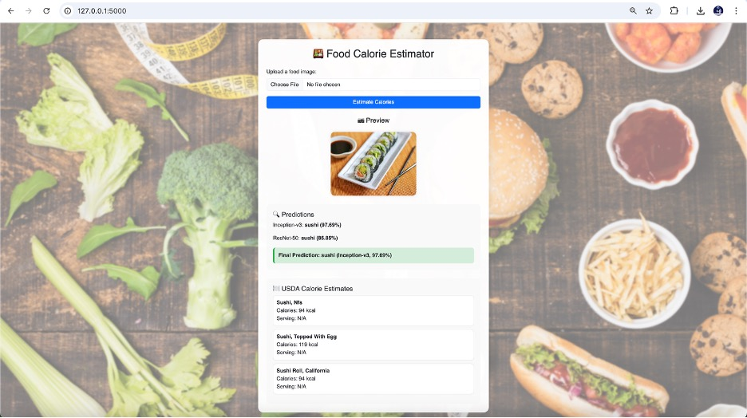
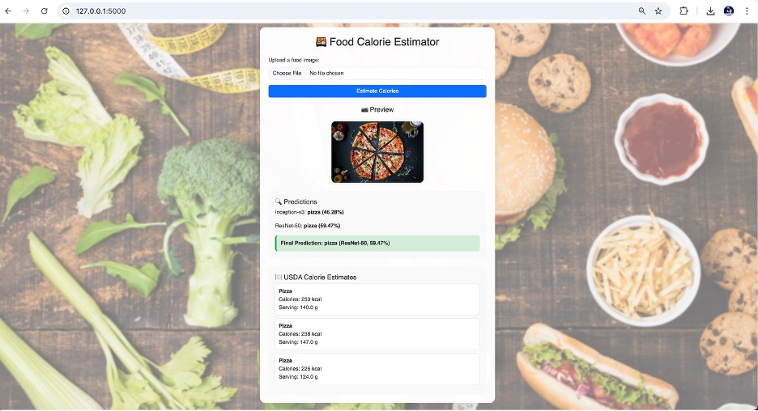
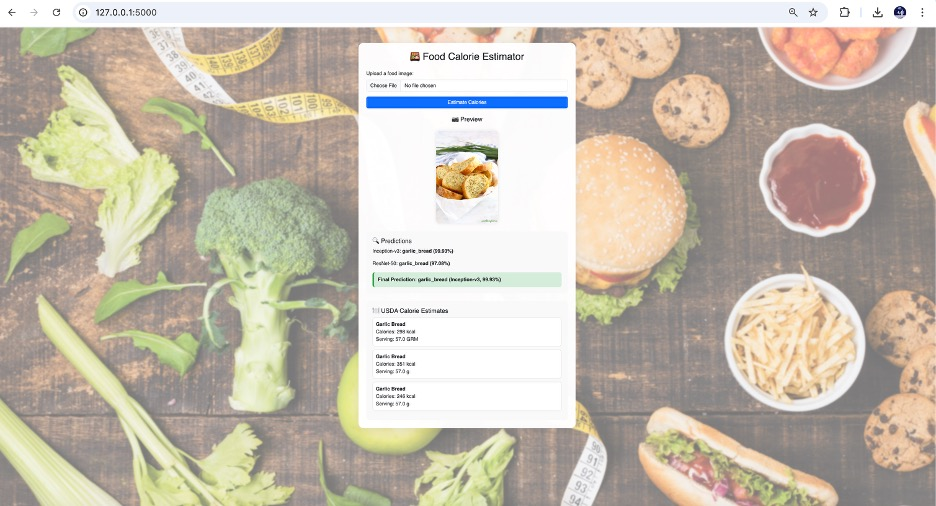

# Food Calorie Estimator

This is an AI-based web app that can recognize food from an image and estimate its calories.

## Features
- Deep learning with InceptionV3 and ResNet50 (94.31% and 92.68% accuracy respectively)
- Trained on the Food-101 dataset (101,000 images)
- Shows calorie info using USDA API
- Built with Python, PyTorch, and Flask

## How to Run
1. Clone this repo
2. Install packages: `pip install -r requirements.txt`
3. Run: `python app.py`

## Team
- Harsh Patel
- Darsh Shah
- Jenil Shah

## References
- Food-101 dataset
- USDA FoodData Central

## Sample Output

Below is an example of how the app recognizes food and estimates calories:

### Sushi Example

### Pizza Example

### Garlic Bread Example

